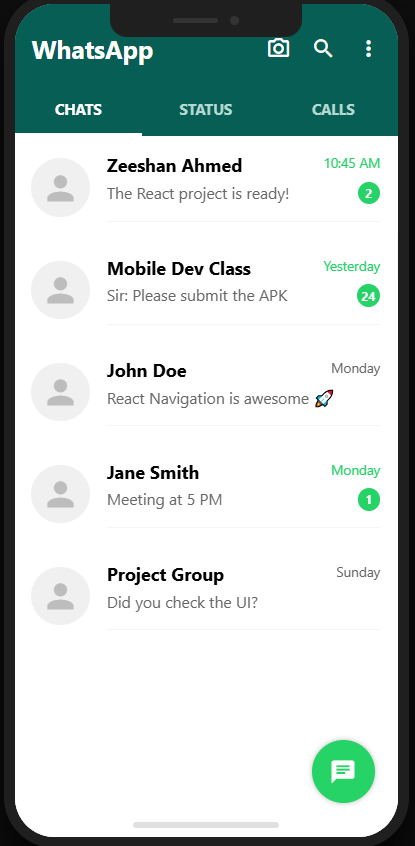
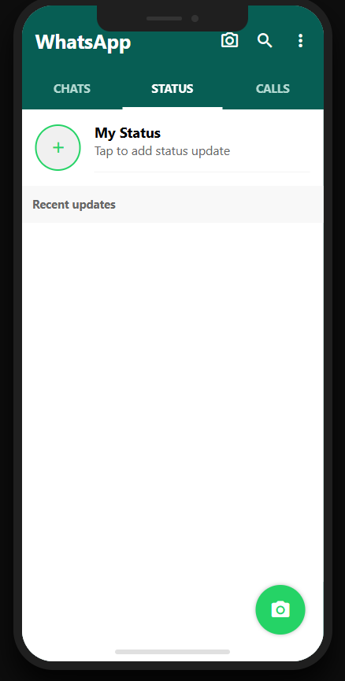
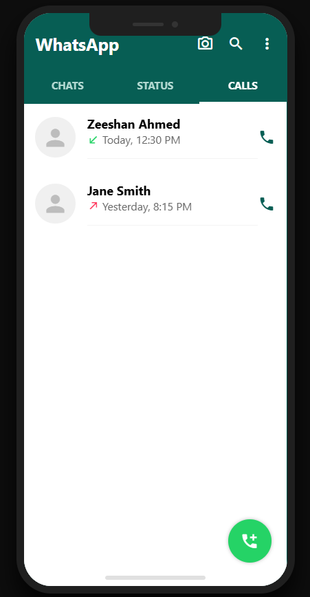

WhatsApp UI Clone - Mobile App Development
📱 Project Overview
This repository contains a high-fidelity WhatsApp UI Clone built using React Native and Expo. This project was developed as part of Assignment #3 to demonstrate proficiency in screen navigation, component structure, and real-world UI replication.

The application replicates the core interface of WhatsApp, specifically focusing on the Android design language, including the signature teal header and swipable tab navigation.

🚀 Features
Three-Screen Architecture: Fully implemented Chats, Status, and Calls screens.

Advanced Navigation: Utilizes @react-navigation/material-top-tabs for smooth swiping between screens.

Professional UI Frame: The app is wrapped in a custom-styled Mobile Device Frame (including a notch and home indicator) for a high-end presentation.

Reusable Components: Developed modular components such as ChatItem, WhatsAppHeader, and FAB (Floating Action Button) to ensure clean and maintainable code.

Dynamic UI Elements: Includes unread message badges, online status indicators, and call type icons (incoming/missed).

🛠️ Technologies Used
React Native (Frontend Framework)

Expo (Development Environment)

React Navigation (Top Tab Navigator)

Expo Vector Icons (MaterialCommunityIcons)

React Native Safe Area Context (For notched display compatibility)

📸 Screen Breakdown
Chats Screen: A list of recent conversations with timestamps and unread message counters.

Status Screen: View your own status and a categorized list of recent updates from contacts.

Calls Screen: A detailed log of incoming and outgoing calls with status indicators.

## 📸 Screens

### Chats Screen

### Status Screen

### Calls Screen

